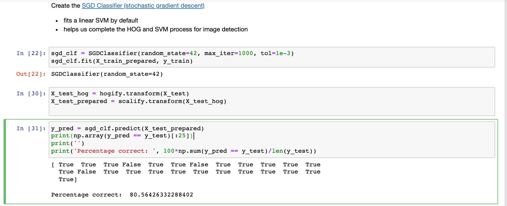
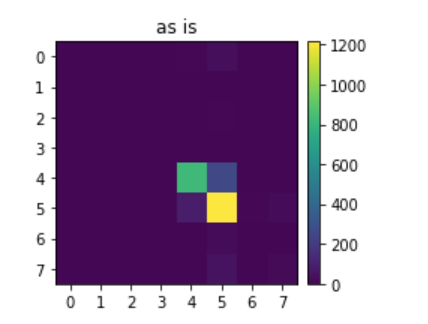
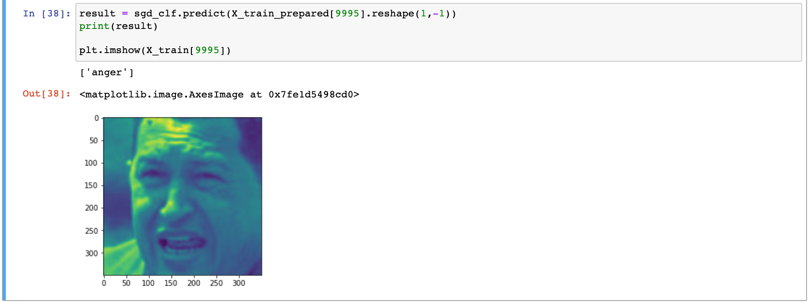

# Emotion Detection with Machine Learning
This project utilizes OpenCV and scikit learn on a Raspberry Pi 3 Model B to categorize the emotion of a face into one of 8 categories. This is done with HOG-SVM (Histogram of Oriented Gradients and Support Vector Machines) trained on the [Facial Expressions Dataset by muxspace](https://github.com/muxspace/facial_expressions) and a live webcam to feed in data. 

| **Engineer** | **School** | **Area of Interest** | **Grade** |
|:--:|:--:|:--:|:--:|
| Helen Feng | Evergreen Valley High School | Computer Science | Incoming Senior

# Final Milestone - Training and Testing
The final milestone of this project was training, testing, and (attempting) to optimize the model. The model creation was rather straightforward from processing. I used sklearn's SGD Classifier object (which fit a linear SVM by default) and reached an accuracy of 80%! This was rather impressive, since the data set I used was very uneven in distributiion of varying emotions. 



Using a confusion matrix, we can see that the model is accurate for most images, as the most predictions appear on the main diagonal of the matrix. However, given the uneven distribution of the emotions, it is clear that only two of the emotions (happiness and neutrality) show up on the confusion matrix. 



The model worked as I'd hoped, as seen below correctly identifying an image to be anger.



I originally wanted to optimize the model and then upload it onto the Raspberry Pi, but due to some unknown errors (for now) I was unable to create the Pipeline. My computer kept crashing trying to run the following cell:

```python
from sklearn.pipeline import Pipeline
from sklearn import svm
 
HOG_pipeline = Pipeline([
    ('grayify', RGB2GrayTransformer()),
    ('hogify', HogTransformer(
        pixels_per_cell=(14, 14), 
        cells_per_block=(2, 2), 
        orientations=9, 
        block_norm='L2-Hys')
    ),
    ('scalify', StandardScaler()),
    ('classify', SGDClassifier(random_state=42, max_iter=1000, tol=1e-3))
])
 
clf = HOG_pipeline.fit(X_train, y_train)
print('Percentage correct: ', 100*np.sum(clf.predict(X_test) == y_test)/len(y_test))
```

# Second Milestone - More Processing
The second  milestone of my project was creating the actual model. At first, I wanted to just detect whether or not someone was smiling for simplicity. However, as the dataset I used had 8 total different emotions that were labelled, I aimed to create an emotion detector. 

To do this, I used sklearn to first split my dataset into train and test sets. I leave 20% of the images for testing.

```python
from sklearn.model_selection import train_test_split

X_train, X_test, y_train, y_test = train_test_split(
    data['image'], 
    data['label'], 
    test_size=0.2, 
    shuffle=True,
    random_state=21
)
```

To train the model, I needed to distinguish features for my model to detect. In order to achieve this, I used a Histogram Oriented Gradient/Support Vector Machine (HOG-SVM) approach. HOG is used for feature extraction and will reduce the size of the image to processable chunks.

```python
from sklearn.linear_model import SGDClassifier
from sklearn.model_selection import cross_val_predict
from sklearn.preprocessing import StandardScaler, Normalizer
import skimage
 
# create an instance of each transformer
# grayify = RGB2GrayTransformer()
hogify = HogTransformer(
    pixels_per_cell=(14, 14), 
    cells_per_block=(2,2), 
    orientations=9, 
    block_norm='L2-Hys'
)
scalify = StandardScaler()
print('instances')

# call fit_transform on each transform converting X_train step by step
X_train_hog = hogify.fit_transform(X_train)
print('hogified')
X_train_prepared = scalify.fit_transform(X_train_hog)
print('scalified')
 
print(X_train_prepared.shape)
```

# First Milestone - Setting Up and Preprocessing
The first milestone of my project was setting up the Raspberry Pi. After downloading the Raspberry Pi imager from the Raspberry Pi [website](https://www.raspberrypi.org/software/), I used a SD card reader to download Raspbian, the latest OS for Raspberry Pis, on the micro sd. With the OS and other necessary parts such as the HDMI cable and the heatsinks, I was able to boot up my Raspberry Pi.
  
Next was starting on the code for this project. I finished preprocessing the [Facial Expressions Dataset](https://github.com/muxspace/facial_expressions.git), which categorizes over 13,000 pictures into 8 expressions after a long time due to complications with my process. 

For example, I initially ran my code on Google Colab, which, unfortunately could not save a fully preprocessed version of my dataset in the form of a pickle file. 


As seen in the gif of the save data bar, running my code on Colab was too slow and limited RAM provided by Google Colab stopped this process at around 70%. Thus, I moved my code to be locally hosted and used Jupyter Notebooks. There was a marginal improvement in the runtime of this saving process as the rate of completion basically tripled (up to around 100 iterations/second), but this allowed other problems to show, like saving inconsistent images and not properly saving strings in the dataframe. After a lot of debugging, the final save data method can be seen below, which properly saved the entire dataset into a pickle file.


```python
def saveData(src, pklname, csv_path, width=350, height=None):
  height = height if height is not None else width

  data = dict() # our data structure
  data['desc'] = 'resized ({0}x{1}) face images in rgb'.format(width, height)
  data['label'] = []
  data['filename'] = []
  data['image'] = []

  pklname = f"{pklname}_{width}x{height}px.pkl" 

  if os.path.exists(pklname):
      os.remove(pklname)

  csv_data = pd.read_csv(csv_path) # create dataframe to match labels and images

  for i in range(len(csv_data)):
    csv_data.iloc[i]['emotion'] = csv_data.iloc[i]['emotion'].lower()
  
  if c.shape[2] != 1:
    im = cv2.cvtColor(im, cv2.COLOR_BGR2GRAY)

  for subdir in os.listdir(src): # src should be '.'
    if subdir == 'images': # grabs images/
      curr_path = os.path.join(src, subdir) # combines ./ and images/ --> ./images/ 
      for file in tqdm(os.listdir(curr_path)): # iterates through files in ./images/
        try:
          im = imread(os.path.join(curr_path, file))
          im = resize(im, (width, height)) # every image we have is 350x350, not needed but good to keep

          index = csv_data.index[csv_data['image']==file][0] # get index of the file we are looking at in the csv file
          data['label'].append(csv_data.iloc[index]['emotion']) # uses iloc (operated by index) to get element (emotion in str form)

          data['filename'].append(file) # image name
          data['image'].append(im) # image data

        except Exception:
          continue
      break

  
  f = open(pklname, "wb")
  pickle.dump(data, open(pklname,"wb")) 
  print('done') # finished loading all data into file
  f.close()
  return
```
Milestone 1 video:
[](https://youtu.be/gA0wkDz3eC8)

